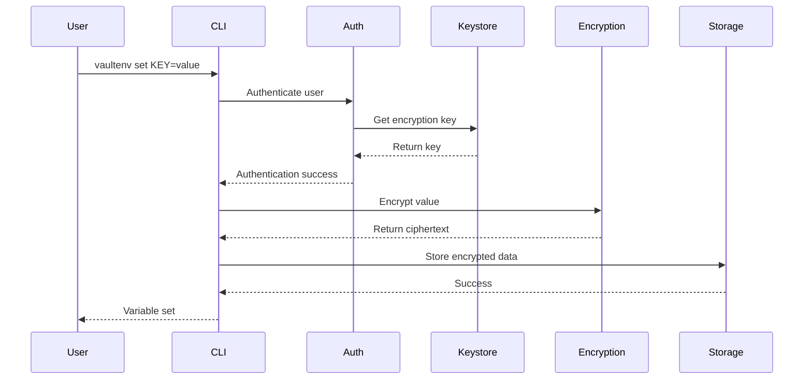
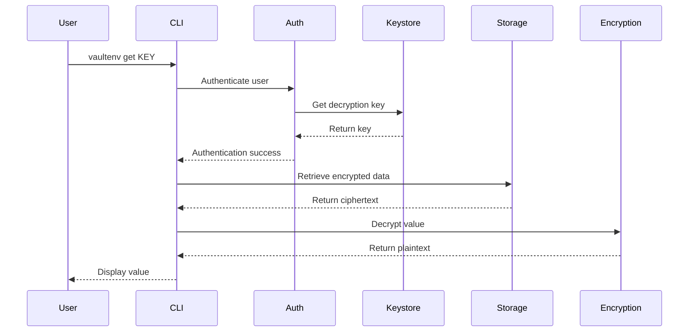

# VaultEnv CLI Architecture

## Table of Contents

- [System Overview](#system-overview)
- [Core Components](#core-components)
- [Security Architecture](#security-architecture)
- [Data Flow](#data-flow)
- [Storage Specifications](#storage-specifications)
- [Encryption Implementation](#encryption-implementation)
- [Plugin System](#plugin-system)
- [Design Decisions](#design-decisions)

## System Overview

VaultEnv CLI is a zero-knowledge environment variable management system designed with security, usability, and extensibility as core principles. The architecture follows a layered approach with clear separation of concerns.

```
┌─────────────────────────────────────────────────────────────────┐
│                        CLI Interface Layer                       │
│                    (cmd/vaultenv-cli/main.go)                   │
└─────────────────┬───────────────────────────────┬───────────────┘
                  │                               │
┌─────────────────▼───────────────┐ ┌─────────────▼───────────────┐
│        Command Layer             │ │      Configuration Layer     │
│       (internal/cmd/)            │ │     (internal/config/)       │
│  • init, set, get, list         │ │  • Config management         │
│  • export, import, sync          │ │  • Environment handling      │
│  • history, audit, migrate       │ │  • Preferences storage       │
└─────────────────┬───────────────┘ └─────────────┬───────────────┘
                  │                               │
┌─────────────────▼───────────────────────────────▼───────────────┐
│                      Business Logic Layer                        │
│                         (internal/*)                             │
│  ┌─────────────┐ ┌──────────────┐ ┌─────────────┐             │
│  │    Auth     │ │   Keystore   │ │     UI      │             │
│  │ (Password   │ │ (Key Mgmt)   │ │ (Terminal   │             │
│  │  Handling)  │ │              │ │  Output)    │             │
│  └─────────────┘ └──────────────┘ └─────────────┘             │
└─────────────────┬───────────────────────────────┬───────────────┘
                  │                               │
┌─────────────────▼───────────────┐ ┌─────────────▼───────────────┐
│       Encryption Layer           │ │       Storage Layer          │
│      (pkg/encryption/)           │ │       (pkg/storage/)         │
│  • AES-256-GCM                  │ │  • File Backend              │
│  • ChaCha20-Poly1305            │ │  • SQLite Backend            │
│  • Deterministic mode           │ │  • Git Backend               │
└─────────────────┬───────────────┘ └─────────────┬───────────────┘
                  │                               │
┌─────────────────▼───────────────────────────────▼───────────────┐
│                    Operating System Layer                        │
│  • File System  • OS Keychain  • Process Environment           │
└─────────────────────────────────────────────────────────────────┘
```

## Core Components

### 1. Command Layer (`internal/cmd/`)

The command layer implements all CLI commands using the Cobra framework. Each command is responsible for:

- **Input validation**: Ensuring user input meets requirements
- **Business logic orchestration**: Coordinating between different components
- **Output formatting**: Presenting results to users
- **Error handling**: Providing meaningful error messages

Key commands:
- `init.go`: Project initialization
- `set.go`/`get.go`: Variable management
- `env.go`: Environment management
- `export.go`/`import.go`: Data portability
- `sync.go`: Git synchronization
- `history.go`: Audit trail access

### 2. Authentication Module (`internal/auth/`)

Handles password management and user authentication:

- **Password validation**: Ensures password strength
- **Key derivation**: Uses Argon2id for deriving encryption keys
- **Session management**: Temporary key caching for convenience
- **OS keychain integration**: Secure password storage

### 3. Keystore Module (`internal/keystore/`)

Manages encryption keys with security as the primary concern:

- **Key generation**: Cryptographically secure random keys
- **Key storage**: Encrypted key persistence
- **Key rotation**: Support for changing encryption keys
- **Environment isolation**: Separate keys per environment

### 4. Storage Layer (`pkg/storage/`)

Provides pluggable storage backends with a unified interface:

```go
type Storage interface {
    Set(key, value string, options ...Option) error
    Get(key string) (string, error)
    List(pattern string) (map[string]string, error)
    Delete(key string) error
    History(key string) ([]HistoryEntry, error)
    Close() error
}
```

Backends:
- **File**: Simple encrypted file storage
- **SQLite**: Advanced features with transaction support
- **Git**: Version-controlled encrypted storage
- **Memory**: Testing and ephemeral use cases

### 5. Encryption Layer (`pkg/encryption/`)

Implements military-grade encryption with flexibility:

```go
type Encryptor interface {
    Encrypt(plaintext []byte, key []byte) ([]byte, error)
    Decrypt(ciphertext []byte, key []byte) ([]byte, error)
    DeriveKey(password string, salt []byte) ([]byte, error)
}
```

Implementations:
- **AES-256-GCM**: Default, NIST-approved
- **ChaCha20-Poly1305**: Alternative modern cipher
- **Deterministic**: Git-friendly encryption for specific use cases

## Security Architecture

### Threat Model

VaultEnv protects against the following threats:

1. **Data at Rest**: All secrets encrypted before storage
2. **Data in Transit**: Local-only by default, encrypted for sync
3. **Memory Exposure**: Keys cleared after use
4. **Unauthorized Access**: Per-environment authentication
5. **Audit Trail**: Complete history of changes
6. **Key Compromise**: Support for key rotation

### Security Principles

1. **Zero-Knowledge**: Server/storage never sees plaintext
2. **Defense in Depth**: Multiple security layers
3. **Least Privilege**: Minimal permissions required
4. **Secure by Default**: Safe defaults, explicit unsafe operations
5. **Cryptographic Agility**: Support for algorithm changes

### Key Security Features

#### 1. Password-Based Encryption
```
Password → Argon2id → Encryption Key → AES-256-GCM → Ciphertext
```

#### 2. Environment Isolation
Each environment has its own:
- Encryption key
- Password/passphrase
- Access control
- Audit trail

#### 3. Secure Key Storage
```
┌─────────────┐     ┌──────────────┐     ┌────────────┐
│   Password  │────▶│   Argon2id   │────▶│    Key     │
└─────────────┘     └──────────────┘     └─────┬──────┘
                                                │
                    ┌──────────────┐            │
                    │ OS Keychain  │◀───────────┘
                    └──────────────┘
```

## Data Flow

### Setting a Variable



### Getting a Variable



## Storage Specifications

### File Backend Format

```json
{
  "version": "1.0",
  "encrypted": true,
  "algorithm": "aes-256-gcm",
  "data": {
    "KEY_NAME": {
      "value": "base64-encoded-ciphertext",
      "nonce": "base64-encoded-nonce",
      "updated": "2024-01-06T10:00:00Z",
      "updatedBy": "user@example.com"
    }
  }
}
```

### SQLite Schema

```sql
-- Main variables table
CREATE TABLE variables (
    id INTEGER PRIMARY KEY,
    environment TEXT NOT NULL,
    key TEXT NOT NULL,
    value BLOB NOT NULL,
    nonce BLOB NOT NULL,
    algorithm TEXT NOT NULL,
    created_at TIMESTAMP DEFAULT CURRENT_TIMESTAMP,
    updated_at TIMESTAMP DEFAULT CURRENT_TIMESTAMP,
    updated_by TEXT,
    UNIQUE(environment, key)
);

-- History tracking
CREATE TABLE history (
    id INTEGER PRIMARY KEY,
    variable_id INTEGER,
    old_value BLOB,
    new_value BLOB,
    operation TEXT,
    timestamp TIMESTAMP DEFAULT CURRENT_TIMESTAMP,
    user TEXT,
    FOREIGN KEY(variable_id) REFERENCES variables(id)
);

-- Audit log
CREATE TABLE audit_log (
    id INTEGER PRIMARY KEY,
    environment TEXT,
    action TEXT,
    key TEXT,
    user TEXT,
    timestamp TIMESTAMP DEFAULT CURRENT_TIMESTAMP,
    ip_address TEXT,
    success BOOLEAN
);
```

### Git Storage Format

For Git-friendly storage, we use deterministic encryption:

```
.vaultenv/
├── development/
│   ├── variables.enc    # Deterministically encrypted
│   └── metadata.json    # Non-sensitive metadata
├── staging/
│   ├── variables.enc
│   └── metadata.json
└── production/
    ├── variables.enc
    └── metadata.json
```

## Encryption Implementation

### Key Derivation

```go
// Argon2id parameters (OWASP recommended)
const (
    argonTime    = 1
    argonMemory  = 64 * 1024  // 64 MB
    argonThreads = 4
    argonKeyLen  = 32         // 256 bits
)

func DeriveKey(password string, salt []byte) []byte {
    return argon2.IDKey(
        []byte(password), 
        salt, 
        argonTime, 
        argonMemory, 
        argonThreads, 
        argonKeyLen,
    )
}
```

### AES-256-GCM Encryption

```go
func (a *AESGCMEncryptor) Encrypt(plaintext, key []byte) ([]byte, error) {
    block, err := aes.NewCipher(key)
    if err != nil {
        return nil, err
    }
    
    gcm, err := cipher.NewGCM(block)
    if err != nil {
        return nil, err
    }
    
    nonce := make([]byte, gcm.NonceSize())
    if _, err := io.ReadFull(rand.Reader, nonce); err != nil {
        return nil, err
    }
    
    ciphertext := gcm.Seal(nonce, nonce, plaintext, nil)
    return ciphertext, nil
}
```

### Deterministic Encryption

For Git-friendly encryption, we use AES-SIV (Synthetic IV):

```go
func (d *DeterministicEncryptor) Encrypt(plaintext, key []byte) ([]byte, error) {
    // Use convergent encryption with HMAC-based key derivation
    contentKey := hmac.New(sha256.New, key)
    contentKey.Write(plaintext)
    derivedKey := contentKey.Sum(nil)
    
    // Encrypt with derived key for deterministic output
    return d.baseEncryptor.Encrypt(plaintext, derivedKey)
}
```

## Plugin System

The plugin system allows extending VaultEnv with custom functionality:

### Plugin Interface

```go
type Plugin interface {
    // Metadata
    Name() string
    Version() string
    Description() string
    
    // Lifecycle
    Initialize(config map[string]interface{}) error
    Execute(args []string) error
    Cleanup() error
    
    // Hooks
    PreSet(key, value string) error
    PostSet(key, value string) error
    PreGet(key string) error
    PostGet(key, value string) error
}
```

### Plugin Loading

```go
type PluginManager struct {
    plugins map[string]Plugin
    hooks   map[string][]Plugin
}

func (pm *PluginManager) LoadPlugin(path string) error {
    // Load shared library
    p, err := plugin.Open(path)
    if err != nil {
        return err
    }
    
    // Get plugin instance
    symbol, err := p.Lookup("Plugin")
    if err != nil {
        return err
    }
    
    plugin, ok := symbol.(Plugin)
    if !ok {
        return errors.New("invalid plugin interface")
    }
    
    // Register plugin
    pm.plugins[plugin.Name()] = plugin
    return nil
}
```

### Example Plugin Use Cases

1. **Vault Integration**: Sync with HashiCorp Vault
2. **Cloud Provider Integration**: AWS Secrets Manager, Azure Key Vault
3. **Notification Systems**: Slack/email on changes
4. **Policy Enforcement**: Naming conventions, value validation
5. **Custom Encryption**: Hardware security module support

## Design Decisions

### 1. Why Client-Side Encryption?

**Decision**: All encryption happens on the client side.

**Rationale**:
- True zero-knowledge architecture
- No trust required in storage/transport
- Compliance with strict security requirements
- User maintains full control

### 2. Why Multiple Storage Backends?

**Decision**: Support file, SQLite, and Git backends.

**Rationale**:
- File: Simple, portable, no dependencies
- SQLite: Advanced features, ACID compliance
- Git: Natural version control integration
- Choice based on team needs

### 3. Why Argon2id?

**Decision**: Use Argon2id for key derivation.

**Rationale**:
- Winner of Password Hashing Competition
- Resistant to GPU and ASIC attacks
- Memory-hard function
- OWASP recommended

### 4. Why Go?

**Decision**: Implement in Go programming language.

**Rationale**:
- Single binary distribution
- Cross-platform support
- Excellent cryptography libraries
- Strong typing for security
- Great CLI frameworks (Cobra)

### 5. Why Per-Environment Passwords?

**Decision**: Separate passwords for each environment.

**Rationale**:
- Principle of least privilege
- Prevent accidental production access
- Different team members, different access
- Compliance requirements

### 6. Why Support Deterministic Encryption?

**Decision**: Optional deterministic mode for Git.

**Rationale**:
- Clean Git diffs for code review
- Deduplication in version control
- Trade-off: Less secure, but practical
- Explicit opt-in required

## Future Considerations

### Planned Enhancements

1. **Hardware Security Module (HSM) Support**
   - PKCS#11 interface
   - YubiKey integration
   - TPM support

2. **Advanced Audit Features**
   - Blockchain-based audit trail
   - Compliance report generation
   - SIEM integration

3. **Performance Optimizations**
   - Caching layer
   - Bulk operations
   - Parallel encryption

4. **Enhanced Plugin System**
   - Plugin marketplace
   - Sandboxed execution
   - WebAssembly plugins

### Scaling Considerations

1. **Large Variable Sets**
   - Indexed storage
   - Pagination support
   - Search optimization

2. **Team Collaboration**
   - Conflict resolution
   - Merge strategies
   - Access control lists

3. **Enterprise Features**
   - SAML/SSO integration
   - Policy engines
   - Compliance frameworks

---

This architecture is designed to be secure by default while remaining flexible enough to meet diverse team needs. The modular design allows for future enhancements without breaking existing functionality.